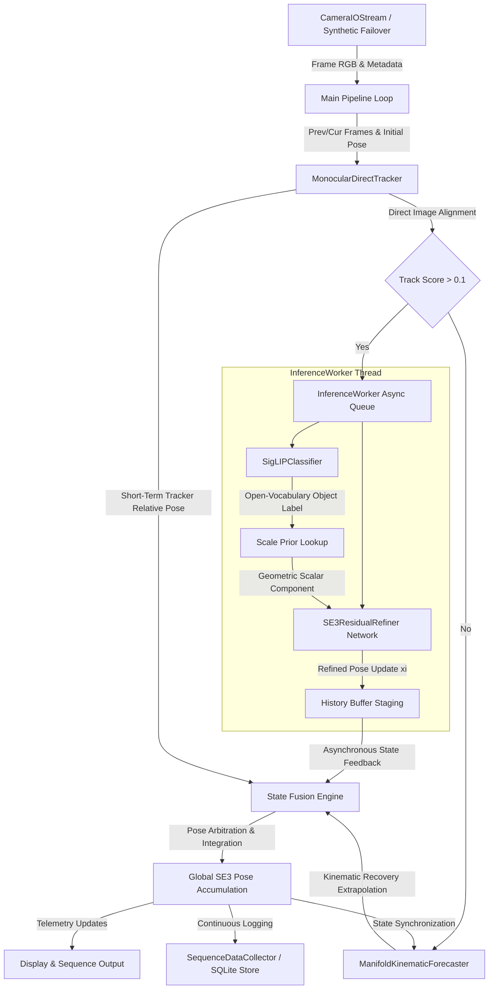

# Lie Equivariant Perception Algebraic Unified Transform Embedding Framework (L.E.P.A.U.T.E. Framework)

## Abstract
The L.E.P.A.U.T.E. Framework is a geometrically unified computer vision and robotics environment engineered for real-time spatial telemetry perception and multi-task optimization. By mapping sequential visual transitions into explicit Lie group representations, specifically the Special Euclidean Group SE(3), the architecture enforces strict structural equivariance across frame-to-frame transformations. Operating on continuous monocular video feeds, the core execution pipeline combines direct image alignment tracking, transformer-based structural embeddings, and zero-shot open-vocabulary vision-language classifiers to resolve high-fidelity camera ego-motion and relative object poses within a decoupled, asynchronous, multi-threaded framework.

## System Overview
The framework decouples data ingestion, asynchronous neural network inference execution, and state-based sequence persistence to maximize operational throughput and prevent main-thread latency blockages. 

## Features and Capabilities

* **Lie Algebra Structural Equivariance**: Direct integration of Special Euclidean Group SE(3) tracking components utilizing customized geometric differentiable layers to warp raw visual feature maps relative to computed coordinate transitions.
* **Asynchronous Multi-Threaded Inference Ring**: High-frequency data stream frames are entirely decoupled from deep learning execution blocks using worker queues, atomic state-locks, and a dynamic Time-To-Live (TTL) history buffer to completely prevent tracking thread interface latency.
* **Hybrid Multi-Mode Pose Fusion**: A robust tracking arbitration layer that dynamically transitions between refined deep learning outputs, direct Gauss-Newton intensity-alignment tracking, and a manifold-based kinematic forecasting recovery loop during periods of severe visual degradation or occlusion.
* **Open-Vocabulary Target Classification**: Embedded zero-shot contrastive image embeddings powered by SigLIP, enabling runtime target tracking definitions and automatic physical dimension scale prior injection without requiring visual categorization head retraining.
* **Robust Hardware Failover Ingestion**: The data acquisition interface implements an automated fallback sequence, instantly spawning a synthetic parametric image sequence generator if the targeted physical capture hardware encounters latency anomalies or connection drops.
* **Deterministic Training Grounding**: Complete optimization infrastructure embedding geometric Huber-loss regression models with contrastive objectives, fully integrated with seed replication and validation partitioning for reproducible offline training passes.

## License

MIT License

## Contributors

### PyCon HK 2025

* Primary contributor: [shz2](https://twitter.com/shivvor2)
* Special thanks to: [BenBenCHAK](https://github.com/BenBenCHAK), [usertam](https://github.com/usertam)

## References

This project is a implementation of [Wu, C. (2025). Lie Equivariant Perception Algebraic Unified Transform Embedding Framework (L.E.P.A.U.T.E. Framework): Achieving Precise Modeling of Geometric Transformations. Document Identification Code: 20250501_01.](https://github.com/dev1virtuoso/Documentation/blob/main/dev1virtuoso/Research/2025/05_2025/20250501/20250501_01.md)