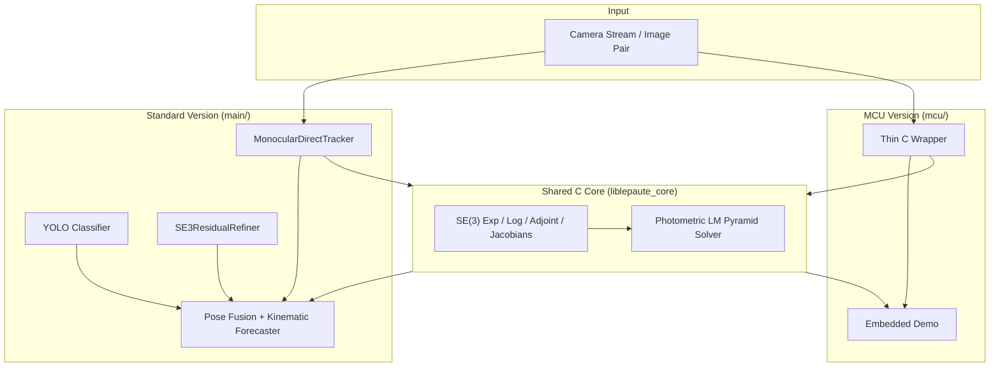

# Lie Equivariant Perception Algebraic Unified Transform Embedding Framework (L.E.P.A.U.T.E. Framework)

## Abstract

L.E.P.A.U.T.E. is a monocular visual pose estimation framework that combines SE(3) Lie group geometry with photometric Levenberg-Marquardt optimization. It provides a high-performance C core for SE(3) operations and dense direct alignment, a full Python research pipeline with residual refinement networks and multi-modal fusion, and a lightweight pure-C implementation suitable for resource-constrained embedded targets. Both the standard and MCU variants share the identical geometric and optimization kernels, ensuring numerical consistency across platforms.

## System Overview

```mermaid
flowchart TB
    subgraph Input
        CAM[Camera Stream / Image Pair]
    end

    subgraph Core["Shared C Core (liblepaute_core)"]
        SE3["SE(3) Exp / Log / Adjoint / Jacobians"]
        LM["Photometric LM Pyramid Solver"]
        SE3 --> LM
    end

    subgraph Standard["Standard Version (main/)"]
        TRACK[MonocularDirectTracker]
        YOLO[YOLO Classifier]
        REF[SE3ResidualRefiner]
        FUSE[Pose Fusion + Kinematic Forecaster]
        TRACK --> FUSE
        YOLO --> FUSE
        REF --> FUSE
    end

    subgraph MCU["MCU Version (mcu/)"]
        WRAP[Thin C Wrapper]
        DEMO[Embedded Demo]
        WRAP --> DEMO
    end

    CAM --> TRACK
    CAM --> WRAP
    TRACK --> Core
    WRAP --> Core
    Core --> FUSE
    Core --> DEMO
```

The architecture centres on a single shared C library that implements SE(3) manifold operations and the multi-scale photometric Gauss-Newton / Levenberg-Marquardt solver. The standard version builds a complete tracking pipeline on top of this core, while the MCU version exposes a minimal C API that links the same kernels under static memory constraints.

## Features and Capabilities

- SE(3) Lie algebra primitives: exponential and logarithmic maps, adjoint representation, and SO(3) left Jacobians with numerically stable handling of near-zero and near-π rotations.
- Photometric pose refinement on image pyramids with Huber robust loss, optional photo-affine illumination parameters, and diagonal preconditioning of the 8×8 Hessian.
- Dual memory models in the shared core: dynamic allocation for desktop use and compile-time static buffers (`LEPAUTE_STATIC_MEM`) for embedded targets.
- Standard pipeline features: dense direct tracking with ORB+PnP fallback, asynchronous deep residual refinement, object-scale priors, and manifold kinematic forecasting.
- MCU pipeline features: pure-C interface, zero heap allocation, reduced pyramid depth and iteration counts, and constant-depth monocular prior.
- Cross-language consistency: Python bindings via ctypes and the embedded C API both call the identical geometric and optimization routines.

## License

MIT License.

## Contributors

### PyCon HK 2025

* Primary contributor: [shz2](https://twitter.com/shivvor2)
* Special thanks to: [BenBenCHAK](https://github.com/BenBenCHAK), [usertam](https://github.com/usertam)

## References

This project is an implementation of [Wu, C. (2025). Lie Equivariant Perception Algebraic Unified Transform Embedding Framework (L.E.P.A.U.T.E. Framework): Achieving Precise Modeling of Geometric Transformations. Document Identification Code: 20250501_01.](https://github.com/dev1virtuoso/Documentation/blob/main/dev1virtuoso/Research/2025/05_2025/20250501/20250501_01.md)

[Dataset](https://huggingface.co/datasets/dev1virtuoso/lepaute-dataset)
