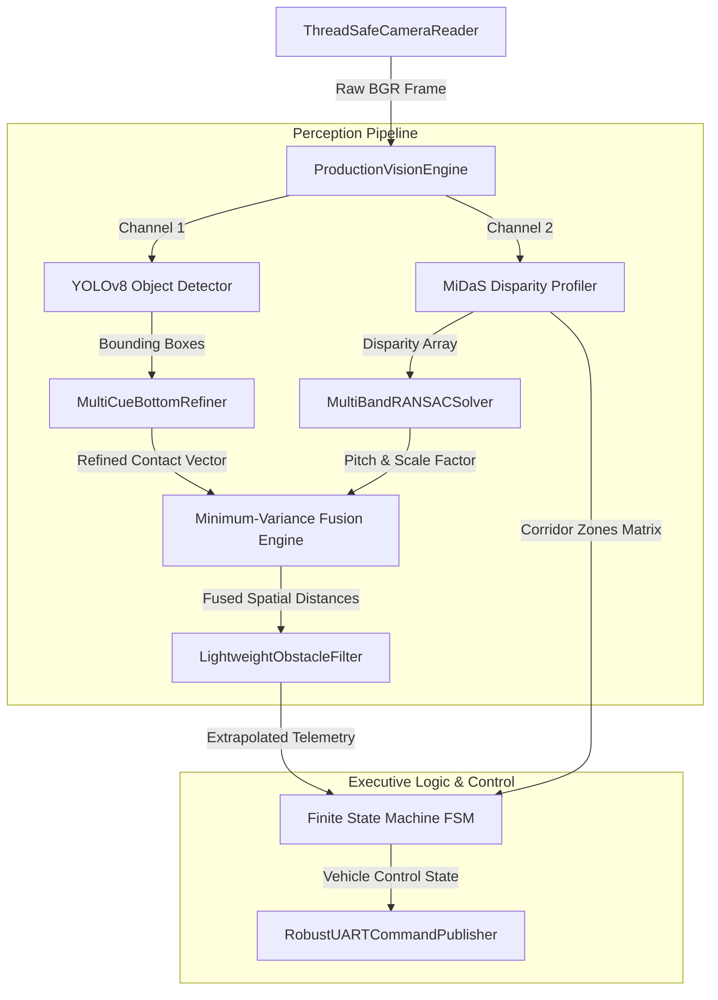

# Lane-Keeping and Obstacle-Avoidance System (L.K.O.A.)

### Abstract
The Lane-Keeping and Obstacle-Avoidance System (L.K.O.A.) is an industrial pure-vision autonomous navigation control engine optimized for deployment on embedded edge platforms. By synthesizing asynchronous dual-buffered camera frames with specialized ONNX-based deep learning models, the system computes real-time environmental depth maps and structural object tracking vectors. L.K.O.A. natively interprets surrounding spatial dynamics to govern a definitive Finite State Machine (FSM), producing linear velocity and lateral steering commands while managing onboard hardware constraints safely.

## System Overview

## Features and Capabilities

* **Asynchronous Double-Buffered Capture Engine:** Utilizes a dedicated V4L2 background worker thread to eliminate input ingestion bottlenecks, complete with automated device recycling and exponential backoff recovery.
* **Dual-Core Embedded ONNX Inference Pipelines:** Parallel processing threads execute specialized instances of YOLOv8 object detection alongside MiDaS spatial disparity estimation, optimized specifically for quad-core ARM architectures.
* **Multi-Band RANSAC Ground Segmentation:** Strategically samples a stratified lower layout matrix to isolate and track the ground plane angle, allowing accurate dynamic calculation of physical distance scaling factors.
* **Multi-Cue Contact Point Refinement:** Fuses high-frequency Sobel intensity filters, Canny edge accumulations, and depth boundary discontinuities to precisely lock onto obstacle ground contact intersections.
* **Minimum-Variance Spatial Fusion:** Synthesizes geometric calculations, strict rigid-body class priors, and monocular depth profiles using a runtime variance engine where measurement uncertainty scales relative to distance.
* **Dynamic Thermal Governance Logic:** Implements automated dual-edge recovery hysteresis to step down deep-model execution frequencies whenever high CPU thresholds are exceeded, ensuring processing stability.
* **High-Availability FSM Interception:** Features immediate safety override triggers for emergency stops alongside a Proportional Navigation law mapping steering outputs continuously during lateral obstacle avoidance.

## Authors

* Carson Wu
* Jonathan Tse

## License

MIT License
