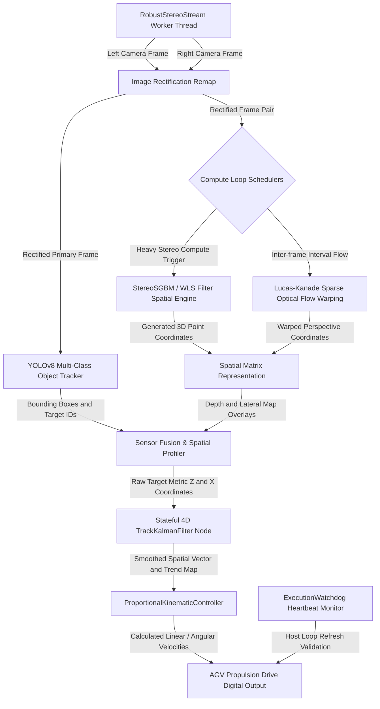

# Vision-based Distance and Object Analysis (ViDiAD)

## Abstract
Vision-based Distance and Object Analysis (ViDiAD) is an embedded, production-grade real-time stereo vision engine and object analytics suite designed specifically for Automated Guided Vehicles (AGVs) deploying on resource-constrained or headless computing hardware such as the Raspberry Pi. By fusing high-accuracy deep learning object detection with low-latency stereo matching, temporal sparse optical flow warping, and stateful 4D Kalman coordinate filtering, the system acts as an independent obstacle evaluation subsystem. It establishes automated lateral safety corridors and dynamic velocity scaling profiles to enforce physical safety constraints headlessly under varying hardware thermal states.

## System Overview
The structural orchestration of the processing nodes, hardware abstractions, and spatial filters within the runtime engine is illustrated below:

## Features and Capabilities

* **Adaptive Depth Computation Scheduling**: Dynamically shifts between intensive StereoSGBM block matching calculations and lightweight Lucas-Kanade sparse optical flow perspective warping depending on host processor refresh rates and thermal performance parameters.
* **Headless Telemetry Interface**: Stripped of standard graphical dependencies and window hooks, the architecture provides console logging abstractions tailored for seamless execution over remote terminal sessions or Secure Shell (SSH) links.
* **Stateful 4D Temporal Filtering**: Uses object-tracked Kalman filters to manage persistent tracking vectors containing dynamic target positions and speeds, reducing data capture anomalies and pixel noise.
* **Proportional Decoupled Kinematics**: Computes responsive steering and deceleration profiles relative to structural coordinates mapped against configurable traveling corridor buffer bounds.
* **Hardware System Watchdog**: Operates an isolated execution monitor thread to trigger safety recovery procedures if the processing loop blocks or drops below real-time performance thresholds.

## License

MIT License.

## Author

* [Carson Wu](https://github.com/dev1virtuoso/Documentation/blob/main/dev1virtuoso/Attachment/dev1virtuoso/carson-wu.md#Contact)
* Jonathan Tse
* Marcus Tong
* Hose Wong
* Wilber Lee
