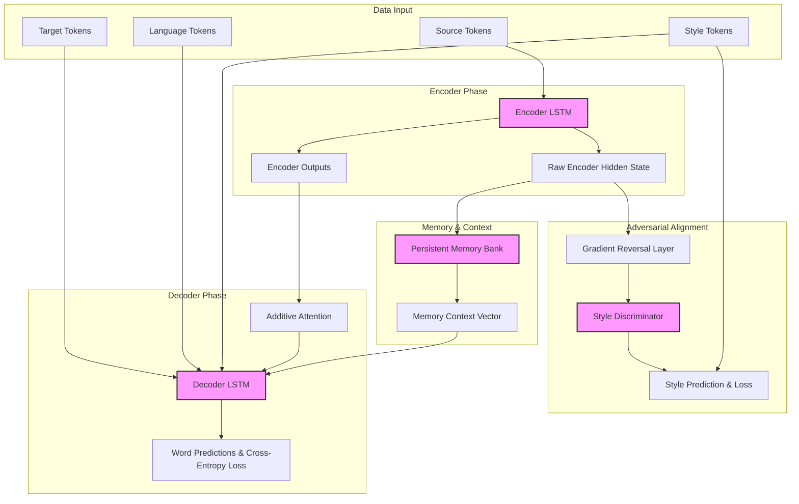

# Artificial Linguistic Learning and Emulation System (A.L.L.E.S.)

## Abstract

The Artificial Linguistic Learning and Emulation System (A.L.L.E.S.) is an exploratory deep learning architecture designed to investigate multi-task sequence-to-sequence language processing, style transfer, and conversational context retention. Developed as a technology exploration project under A.R.I.E.L. The codebase leverages recurrent neural networks (LSTMs) coupled with additive attention, adversarial style discriminators via gradient reversal, and persistent memory networks to emulate specific personas across multilingual setups without relying on modern Transformer-based architectures.

## System Overview

The following diagram describes the processing flow and modular relationships within the A.L.L.E.S. architecture during a combined training step, highlighting the interactions between the sequence-to-sequence model, the persistent memory layer, and the adversarial style alignment loop:

## Features and Capabilities

* **Multilingual Sequence Translation**: Implements a shared-embedding space variant using conditional language tokens appended to recurrent representations, facilitating zero-shot and few-shot cross-lingual transitions.
* **Adversarial Style Emulation**: Utilizes a separate Style Discriminator combined with a Gradient Reversal Layer (GRL) to decouple stylistic attributes from core semantic vectors, ensuring target-driven persona and dialect mirroring.
* **Catastrophic Forgetting Mitigation**: Integrates Elastic Weight Consolidation (EWC) to calculate and apply a quadratic penalty based on the Fisher Information Matrix, preserving past linguistic competencies during sequential multi-task fine-tuning.
* **Persistent Context Management**: Employs an external key-value Memory Bank module executing continuous, length-masked contextual operations across multi-turn session simulation data.
* **Dynamic Curriculum Progression**: Coordinates training via a step-driven scheduling protocol that scales target token length thresholds and downscales denoising noise injection ratios over elapsed training steps.
* **Worker-Safe Memory-Mapped Dataset**: Provides high-throughput, low-latency line indexing using memory-mapped files (`mmap`), preventing open file descriptor leaks when dispatching parallel PyTorch multi-process workers.

## License

MIT License.

## Author

Carson Wu, 2022-2023

