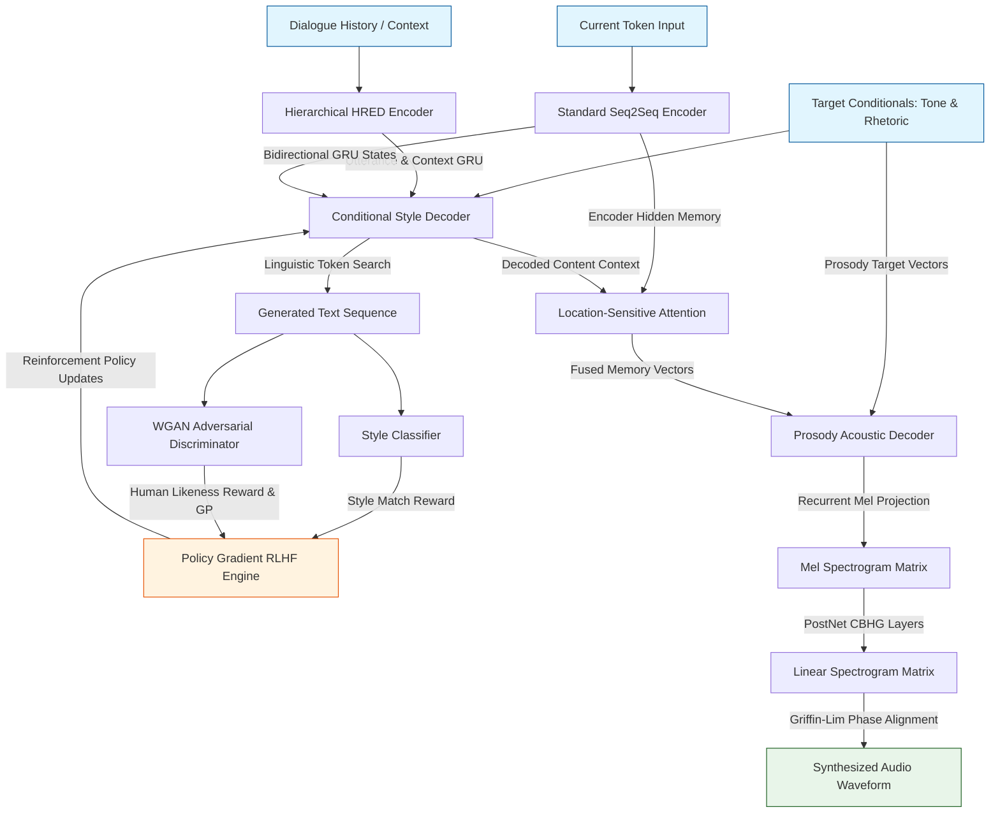

# H.A.R.P.E.R. (Humane Analysis of Rhetoric, Pronunciation, and Expression in Response)

## Abstract
The Humane Analysis of Rhetoric, Pronunciation, and Expression in Response (H.A.R.P.E.R.) framework, engineered in 2022, represents a foundational technology exploration project developed for the Human Utterance Tone, Word Choice, and Style Prediction System of the Autonomous Neural Avatar (A.N.A.). The system establishes an end-to-end multi-modal deep learning pipeline capable of ingesting textual dialogue history, analyzing strategic linguistic features, executing stylized generative responses via policy-gradient reinforcement learning, and mapping outputs directly to continuous acoustic features for prosody-aware speech synthesis. By integrating stylized sequence-to-sequence generation, hierarchical dialogue modeling, adversarial real-human discriminators, and location-sensitive neural speech decoders, H.A.R.P.E.R. provides a robust mathematical architecture for syntactically complex and stylistically nuanced human-machine interaction.

## System Overview
The architecture is structured around a centralized text-and-speech generation pipeline, orchestrating multi-turn context tracking, linguistic feature classification, and continuous acoustic synthesis. The multi-modal data distribution maps sequence inputs to dual output vectors consisting of stylized discrete textual log-probabilities and continuous mel-spectrogram streams.

## Features and Capabilities

### Hierarchical and Sequence-to-Sequence Dialogue Modeling

* Dual-pipeline architecture executing both standard `HarperSeq2Seq` structures and multi-turn `HarperHRED` (Hierarchical Recurrent Encoder-Decoder) pipelines.
* Utterance-level encoding managed via bidirectional Gated Recurrent Units (GRU) utilizing packed sequence alignment to maintain performance over variable-length inputs.
* High-level context integration via a secondary `ContextRNN` keeping structural history maps across consecutive dialogue turns.
* Neural alignment implemented through dot-product Luong Attention mechanisms operating over conditional spaces.

### Stylized Linguistic and Rhetorical Injection

* Intentional style manipulation via target tone embeddings and continuous rhetorical projection layers transforming high-dimensional syntax profiles into localized state vectors.
* Dual-tier `ConditionalStyleDecoder` processing combined linguistic, stylistic, and structural conditioning inputs simultaneously.
* Rule-based and statistical `RhetoricAnalyzer` capable of identifying structural stylistic markers, including anaphora, chiasmus, rhetorical questions, and metaphorical constructs.
* Latent linguistic representation matching using a deep `RhetoricBiLSTM` neural classifier to parse underlying syntactic distributions.

### Reinforcement Learning via Human Feedback (RLHF)

* Policy Gradient RLHF subsystem optimizing discrete sequence generation properties beyond cross-entropy boundaries.
* Customized policy agent utilizing token-level multinomial sampling, tracking sequence log-probabilities, and tracking structural entropy distributions.
* Reward function balancing structural human-likeness outputs against exact targeted style classification probabilities.
* Baseline tracking modules utilizing moving mean and running variance equations to stabilize advantage coefficient convergence.

### Adversarial Quality Validation

* Wasserstein GAN (WGAN) discriminator designed as a multi-filter 1D convolutional neural network (`AdversarialDiscriminator`) operating natively across token embedding spaces.
* Stabilized training mechanics utilizing a continuous gradient penalty calculation (`compute_gradient_penalty`) mapping intermediate linear interpolations.
* Generation variance verification backed by automated sequence perplexity (`NLLLoss`) calculation modules.

### Speech Synthesis and Acoustic Prosody Mapping

* Integrated `ProsodyAcousticDecoder` managing multi-stage text-to-speech tasks patterned on the Tacotron architecture.
* Spatial context mapping using a Recurrent Location-Sensitive Attention module maintaining alignment histories via 1D convolutional weight maps.
* Multi-tier PostNet refinement subsystem driven by a Convolution Bank, Highway Networks, and bidirectional GRU (CBHG) structure transforming mel-scale representations into linear spectrum fields.
* Phase reconstruction pipeline using an optimized `Griffin-LimVocoder` executing iterative short-time inverse Fourier transforms.
* Statistical validation of behavioral target shapes using a Dynamic Time Warping (`_dtw_alignment`) algorithm tracking continuous pitch prosody correlations.

## License

MIT License.

## Author

Carson Wu, 2022-2023
