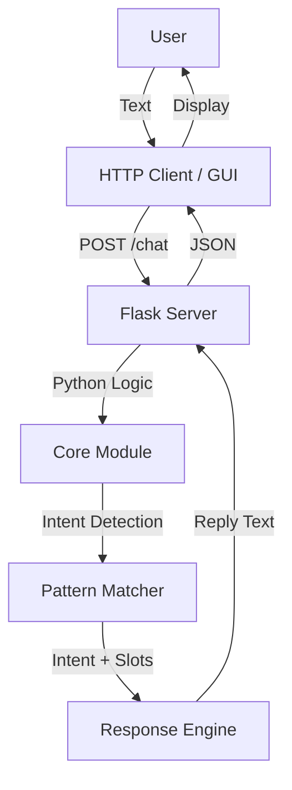

# A.B.C. (Advance Bot for Chatting) v1.0 (Offline Edition)

## Abstract

A.B.C. v1.0 is a lightweight, rule‑based chatbot created in 2015‑2016 by Carson Wu. It operates entirely offline, making it suitable for environments without internet access. The bot uses regular‑expression intent matching, simple natural‑language processing, and a finite‑state machine for dialog management. It is a useful reference for early‑stage AI development and educational purposes.

## System Overview



The diagram shows the full flow from a user message to a response, including the optional GUI front‑end and the server that performs the core logic.

## Features and Capabilities

- Rule‑Based Intent Recognition: Patterns are defined in `patterns.py` and matched with regular expressions.
- Basic NLP: Tokenization, stemming, and POS tagging via NLTK (optional dependency).
- Finite State Machine: Conversation state is managed through a simple context store.
- Context Awareness: Stores user name and location for personalized replies.
- Slot‑Filling: Templates are rendered with `{name}` and `{location}` placeholders.
- Offline Operation: No external API calls; all logic runs locally.
- Text‑Only Output: Purely conversational, no multimedia support.

## Usage Instructions

### API Usage (HTTP Server)

The server exposes a single endpoint:

```
POST /chat
Content-Type: application/json

{ "message": "your text" }
```

Response:

```json
{ "reply": "bot response" }
```

A minimal example client is provided in `example.py`.

### GUI Usage

Run `run_local.py` to launch the Tkinter front‑end.  
Type a message in the entry field and press Enter or Send.  
The conversation history is displayed in the scrolling text widget.

## System Architecture

- `core/`: Core package containing the logic.
  - `main.py`: Entry point for response generation (`abc_respond`).
  - `context.py`: Simple in‑memory context storage.
  - `patterns.py`: List of intent definitions, patterns, and responses.
- `server.py`: Flask application exposing the `/chat` endpoint.
- `ui.py`: Tkinter GUI implementation.
- `example.py`: Sample client that communicates with the server.
- `requirements.txt`: Minimal runtime dependencies (`Flask==0.12.2`).

All modules are deliberately small to keep the system understandable and maintainable.

## License

MIT License

## Author

Carson Wu  
Designed and authored in 2015‑2016 as a proof‑of‑concept for accessible AI interaction.  