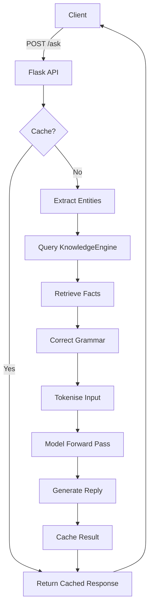

# A.R.I.E.L. (Advanced Retrieval and Inference Engine for Learning) v2.0
Developed by Carson Wu  

## Abstract  

A.R.I.E.L. v2.0 is a modular natural‑language interface that combines a knowledge‑base, graph‑based retrieval, and a sequence‑to‑sequence neural model to answer user queries.  It incorporates on‑the‑fly grammar correction, caching with Redis, and a lightweight API built with Flask. The system is designed to be easily extended with new entities, facts, or language models.

## System Overview  

## Features and Capabilities  

| Capability | Description |
|---|---|
| **Knowledge Graph** | SQLite‑backed store of entities and key/value facts with efficient lookup. |
| **Grammar Refinement** | Seq2Seq model that corrects user input before semantic analysis. |
| **Caching** | Redis cache for query‑fact pairs to reduce database load. |
| **Model Architecture** | Bidirectional GRU encoder, rational gate, and unidirectional GRU decoder. |
| **Context Awareness** | Includes retrieved facts in the reply and tracks hallucination risk. |
| **API** | `/ask` endpoint accepts JSON `{ "text": "..."} ` and returns structured JSON. |
| **CLI Client** | `client.py` demonstrates how to call the API from command line. |
| **Desktop Client** | Tkinter GUI (`ui.py`) for interactive chat. |
| **Asynchronous Tasks** | Celery worker (`worker.py`) for background fact extraction. |

## License  

MIT License

## Author  

Carson Wu, 2017-2023