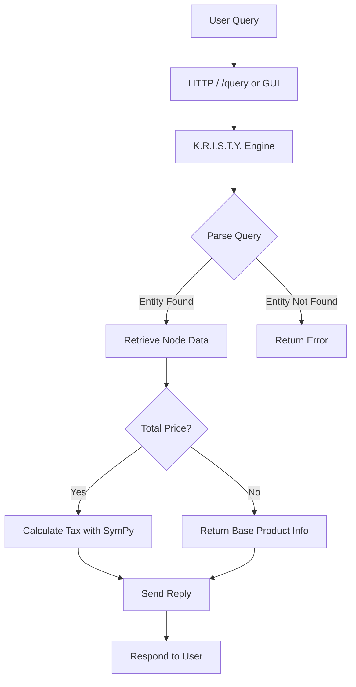

# K.R.I.S.T.Y. (Knowledge Retrieval and Inference System for Test Yielding) v1.0

## Abstract  
K.R.I.S.T.Y. v1.0 is a lightweight Python system that combines a small knowledge base, graph‑based reasoning, and symbolic mathematics to answer product‑related queries.  The engine loads product data into a directed graph, attaches tax information, and uses NLTK for tokenisation.  Symbolic expressions from SymPy compute tax‑inclusive prices, while networkx handles graph relationships.

## System Overview  

## Features and Capabilities  

| Feature | Description |
|---|---|
| Knowledge Graph | Products stored as nodes; tax rate as a separate node; edges model tax subjectivity. |
| Natural Language Tokenisation | Uses NLTK’s `word_tokenize` to break user queries into tokens. |
| Symbolic Mathematics | SymPy calculates total prices with tax, enabling accurate, formula‑based responses. |
| HTTP API | `/query` endpoint accepts JSON payloads (`{"text":"..."} `) and returns JSON replies. |
| Desktop Client | Tkinter GUI (`kristy_gui.py`) for interactive querying without a web client. |
| Data Preparation | `prepare.py` builds an SQLite database with product and metadata tables. |
| Extensibility | New product types, relations, or calculation rules can be added by updating the graph or handler. |

## License  

MIT License

## Author  

Carson Wu, 2016‑2017.