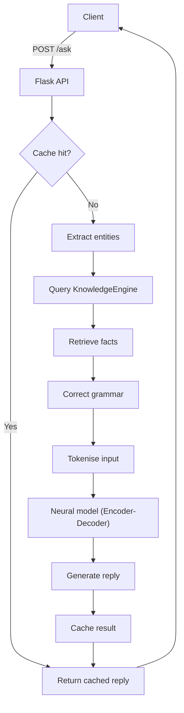

# K.R.I.S.T.Y. (Knowledge Retrieval and Inference System for Test Yielding) v3.0  

## Abstract  

K.R.I.S.T.Y. v3.0 is a compact, Python‑based framework for building question‑answering systems that combine a relational knowledge base with neural inference.  The 3.0 release introduces a more efficient tokeniser, a lightweight cache layer, and a modular grammar‑repair engine, allowing developers to deploy a high‑performance assistant in a few lines of code.

## System Overview  

## Features and Capabilities  

| Capability | Description |
|---|---|
| **Relational Knowledge Base** | SQLite tables for entities and facts with efficient N‑gram entity extraction. |
| **Neural Response Generation** | Bidirectional GRU encoder with a rational gate, unidirectional GRU decoder, and a soft‑max output layer. |
| **Grammar Correction** | Sequence‑to‑sequence model that refines user input before semantic processing. |
| **Caching** | Redis‑backed key/value store that reduces repeated database lookups. |
| **Extensible Fact Engine** | Easy addition of new entities or facts through `KnowledgeEngine.add_entity` and `add_fact`. |
| **CLI & HTTP APIs** | Simple JSON interface (`/ask`) and a lightweight command‑line client. |
| **Asynchronous Context Retrieval** | Celery tasks (`fetch_context_async`) for background fact aggregation. |

## License  

MIT License

## Author  

Carson Wu, 2023-2024