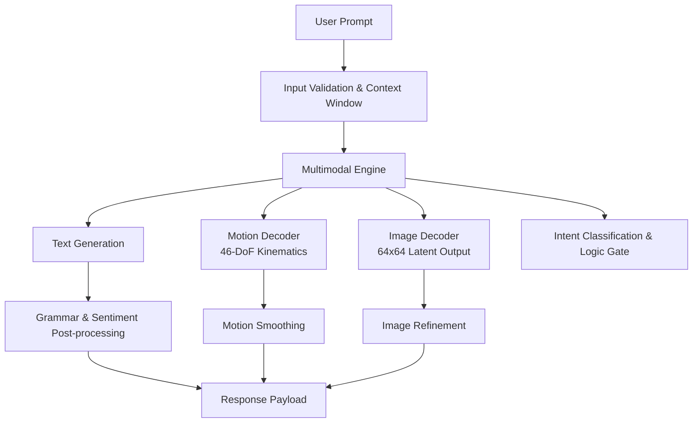

# K.R.I.S.T.Y. (Knowledge Retrieval and Inference System for Test Yielding) v4.0

## Abstract

K.R.I.S.T.Y. is a multimodal inference engine that integrates natural language processing, motion generation, and image synthesis. Developed between 2020 and 2025, it enables coordinated text responses, kinematic motion sequences, and latent visual outputs from single text prompts.

## System Overview

## Features and Capabilities

- Real-time multimodal output generation combining text, motion, and image data
- 46 degrees of freedom motion synthesis with temporal smoothing
- Latent image generation with FiLM-conditioned upsampling
- Knowledge graph enhanced routing via GCN layers
- Semantic moderation and input validation safeguards
- Context-aware memory management with token-limited windows
- Production-ready inference pipeline with error handling and fallbacks
- Concurrent request support through thread-safe singleton design

## License  

MIT License

## Author  

Carson Wu, 2024-2025