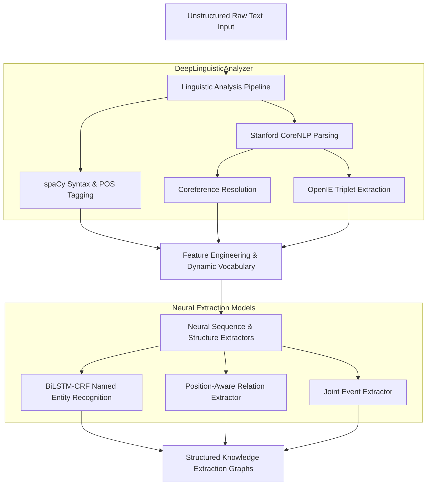

# Linguistic Analysis and Knowledge Extraction System (L.A.K.E.S.)

## Abstract
The Linguistic Analysis and Knowledge Extraction System (L.A.K.E.S.) is a specialized technology exploration project designed as an upstream informational extraction engine for the Advanced Retrieval and Inference Engine for Learning (A.R.I.E.L.). It integrates deterministic deep linguistic parsing with deep stochastic sequence and structured neural architectures (BiLSTM-CRF, Position-Aware Relation Networks, and Joint Event Classifiers) to convert unstructured text into dense, relationally bound knowledge structures.

## System Overview

## Features and Capabilities

* Deep Linguistic Pipeline: Combines spaCy for fast token-level dependency syntax features and Stanford CoreNLP for heavy-duty coreference resolution, parsing tree structures, and open information extraction patterns.
* Hybrid Distance Supervision: Features automated text-to-knowledge-base token alignment using fuzzy Jaccard character overlaps and inverted string matching indexes to synthetically construct weak supervision labeling pairs.
* Unified Extraction Topology: Integrates distinct structural deep learning modules to reconstruct implicit structural representations:
* Sequential Named Entity Recognition via BiLSTM-CRF.
* Positional-aware relation boundaries using dual entity-relative coordinate grids, bi-directional LSTMs, and global additive sequence attention layers.
* Joint neural trigger-and-role structures via a collaborative loss optimization schedule.
* Vectorized Sequence Batching: Employs dynamic tensor transformations using runtime packed sequences to maintain efficient variable-length sentence structures on both CPU and CUDA interfaces.

## License

MIT License.

## Author

Carson Wu, 2022-2023
