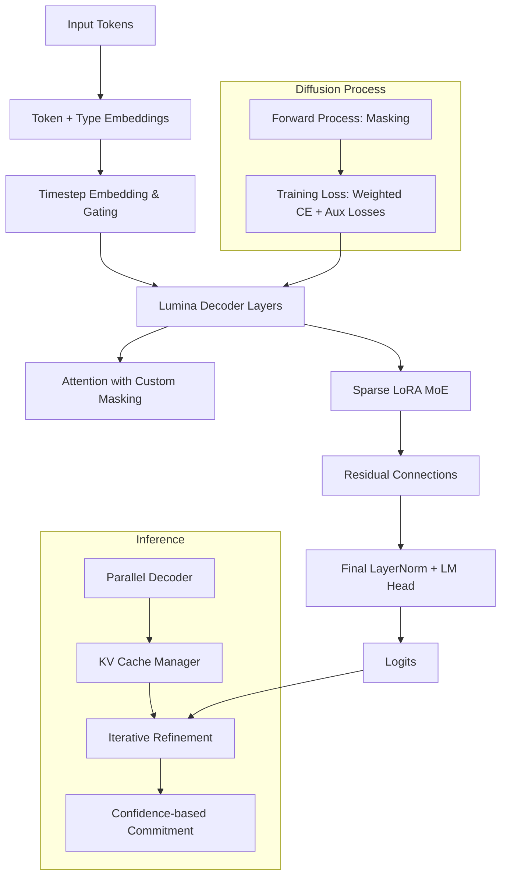

# LoRA Unified MoE Iterative Neural Architecture (L.U.M.I.N.A.)

## Abstract

L.U.M.I.N.A. is a masked diffusion language model that integrates Sparse LoRA-based Mixture-of-Experts (MoE) layers within a transformer decoder architecture. It employs a cosine-based noise schedule and parallel decoding strategy to enable efficient, high-quality text generation through iterative refinement of masked tokens.

## System Overview

## Features and Capabilities

- Masked diffusion training with importance sampling schedule
- Sparse LoRA Mixture-of-Experts layers for parameter efficiency
- Rotary positional embeddings with dynamic caching
- Custom attention masking for committed vs. draft tokens during parallel decoding
- Timestep-dependent conditioning via MLP gating
- Auxiliary losses for routing balance and z-loss regularization
- Parallel iterative decoding with confidence thresholding and top-p sampling
- Support for prompt conditioning and end-of-text early stopping

## License

MIT License

## Author

Carson Wu

## References

This project is a implementation of [Wu, C. (2026). L.U.M.I.N.A. (LoRA Unified MoE Iterative Neural Architecture): LoRA Adaptation of a ~26B MoE Diffusion Language Model (DLM) for Parallel Text Generation Document Identification Code: 20260701_01.](https://github.com/dev1virtuoso/Documentation/blob/main/dev1virtuoso/Research/2025/07_2026/20250701/20250701_01.md)